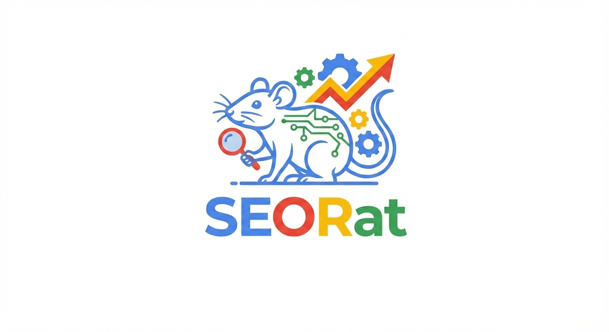

# seo_rat

<!-- WARNING: THIS FILE WAS AUTOGENERATED! DO NOT EDIT! -->

## Why seo_rat?

Most SEO tools cost \$100+/month and are built for WordPress. If you
build with Astro, Quarto, or nbdev — there’s nothing for you.

`seo_rat` is a free, open-source alternative that runs locally, uses
your real Google Search Console data, and is designed to work with AI
coding agents without wasting tokens.

There are two camps in SEO right now: 1. People stuffing content with
AI-generated keywords 2. People saying AI SEO is all garbage

We take a third path — **context-aware optimization with a human in the
loop**. The tool surfaces real opportunities from your data; you decide
what to act on.

**Three ways to use it:** - CLI for power users - Web app (coming soon,
powered by HTMX) - Notebooks for experimentation (via nbdev)

**Principles:** - Real GSC data, no artificial limits - Surface content
gaps based on your site’s goals, not generic keyword stuffing - Minimal
token usage — designed for coding agents - Not locked to any paid AI
provider

## Features

**Data Sync** - Pull and store GSC data locally with smart gap detection
(no re-downloading existing data) - Sync multiple sites

**Content Analysis** - Full site SEO report: titles, descriptions, H1/H2
structure, internal links, content freshness - Single page audit -
Missing queries per page (queries you rank for but haven’t addressed in
content) - Duplicate title/description detection

**Keyword Intelligence** - Keyword ranking with period-over-period
change - High-impression, low-ranking opportunities (`seo-rat-wins`) -
Keyword trend over time, aggregated by day/week/month - Keyword
cannibalization detection (exact + content similarity via MinHash)

**Traffic Insights** - Top pages by clicks or impressions - Country
traffic breakdown with click share - Date range comparison between two
periods

**Index Tracking** - Check page indexing status via GSC URL Inspection
API - Store and track history over time - Report non-indexed pages
grouped by coverage reason

## Roadmap

- Web UI (FastHTML + HTMX)
- Bing integration (IndexNow)
- DSPy-powered Features.
